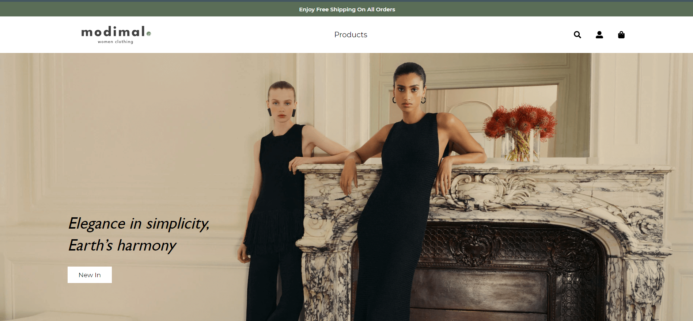

# GPA TEST - [Demo](https://golpakhsh-interview-test.vercel.app/)

Golpakhsh TEST interview shop is a SHOP app using TypeScript, React, Axios and other related technologies.



## Features

- Responsive design
- Developer friendly extendable code
- …and much more

See a working example at [nimaprmdi.github.io/golpakhsh-interview-test/](https://github.com/nimaprmdi/golpakhsh-interview-test).

## installation

1.  Clone the project into wanted destination location using `git clone https://github.com/nimaprmdi/golpakhsh-interview-test.git`
2.  Run command `npm install`
3.  Run command `npm build`
4.  You Will find production build in <b>build</b> folder

## Theme structure

```shell
/golpakhsh-interview-test/               # → Root of your theme
│   App.css
│   App.test.tsx
│   App.tsx
│   index.css
│   index.tsx
│   logo.svg
│   react-app-env.d.ts
│   reportWebVitals.ts
│   setupTests.ts
│
├───assets
│   ├───fonts
│   │       gillsansmt.woff
│   │       gillsansmt.woff2
│   │
│   └───images
│       │   cta-bg-1.jpg
│       │   hero.png
│       │   login-image.jpg
│       │   Logo.svg
│       │   Order.png
│       │
│       └───masonry-images
│               masonry-(1).jpg
│               masonry-(2).jpg
│               masonry-(3).jpg
│               masonry-(4).jpg
│               masonry-(5).jpg
│
├───components
│   │   Cta.tsx
│   │   Hero.tsx
│   │   Masonry.tsx
│   │
│   ├───cart
│   │       Breadcrumb.tsx
│   │       CartItem.tsx
│   │       Content.tsx
│   │       Header.tsx
│   │
│   ├───checkout
│   │   │   CheckoutItems.tsx
│   │   │
│   │   └───forms
│   │           CheckoutForm.tsx
│   │
│   ├───common
│   │       Dropdown.tsx
│   │       Footer.tsx
│   │       InputElement.tsx
│   │       Navbar.tsx
│   │       NumberElement.tsx
│   │       Pagination.tsx
│   │       SearchInputElement.tsx
│   │
│   ├───filter
│   │       FilterItem.tsx
│   │       FilterSubmition.tsx
│   │
│   ├───forms
│   │       ShippingExpectedDate.tsx
│   │       ShippingGuaranteed.tsx
│   │
│   ├───icons
│   │       Close.tsx
│   │
│   ├───shipping
│   │       Shipping.tsx
│   │
│   └───shop
│           Badge.tsx
│           Card.tsx
│           Cards.tsx
│           Categories.tsx
│           OrderSummary.tsx
│           ProductMedium.tsx
│           ProductWide.tsx
│
├───helpers
│   │   utils.ts
│   │
│   └───validation
│           schemas.ts
│           validate.ts
│
├───hooks
│       useAuth.tsx
│       useCart.tsx
│       useFilter.tsx
│       useProducts.tsx
│       useSearch.tsx
│
├───layouts
│       AuthLayouts.tsx
│       MainLayout.tsx
│       SecondaryLayout.tsx
│
├───models
│       auth.ts
│       cart.ts
│       error.ts
│       forms.ts
│       products.ts
│
├───pages
│       CartPage.tsx
│       CheckoutPage.tsx
│       HomePage.tsx
│       LoginPage.tsx
│       PaymentSuccessPage.tsx
│       ShippingPage.tsx
│       ShopPage.tsx
│       ShopSinglePage.tsx
│
├───services
│       GolpakhshApiServices.ts
│       httpServices.ts
│
└───store
    │   configureStore.ts
    │   rootReducer.ts
    │
    ├───auth
    │       authActions.ts
    │       authReducers.ts
    │
    ├───cart
    │       cartActions.ts
    │       cartReducers.ts
    │
    └───products
            productsActions.ts
            productsReducers.ts
```

## Theme development

- Run `npm install` from the theme directory to install dependencies
- Run `npm start` and have fun
